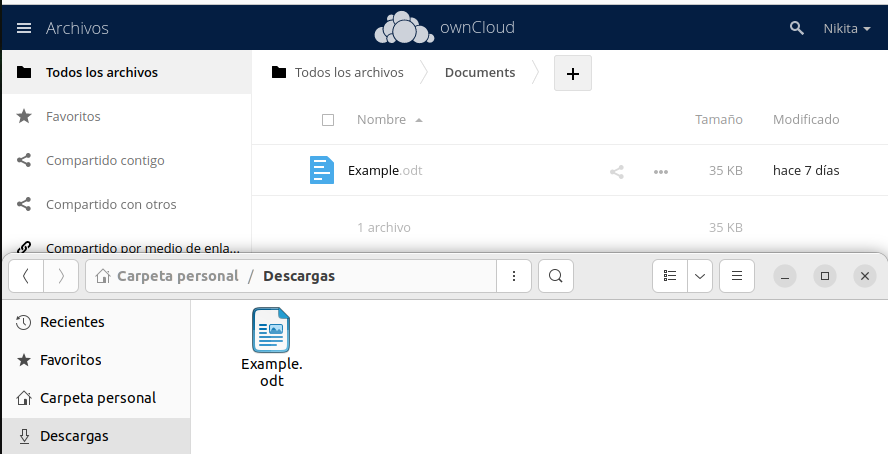
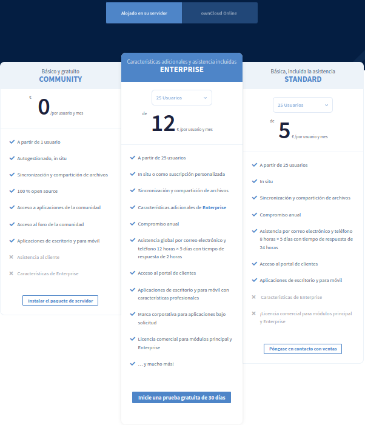

# Activitat 3:

### 3.1.- Llista els Virtual Hosts d'Apache per tal de veure si owncloud.XYZ.com està habilitat amb la comanda:
Aquesta comanda permet veure tots dominis disponibles que tens i les IPs també.

### 3.2.- A Owncloud podem veure que hi ha una serie de carpetes per defecte, mostra la ruta real a les tres carpetes dins de la teva MV.

### 3.3.- Al directori Learn more about owncloud hi ha informació en forma de fitxers pdf. Consulta'ls i respon aquestes preguntes:

1. Quin són els tres tipus de protecció de dades que ofereix Owncloud?

SSO / SAML 2.0
AD/ LDAP
Autenticación de 2 factores

2. Fes una petita descripció de cada un d'ells.

·SSO/SAML 2.0
ownCloud admet SSO (Single Sign-On) i l'autenticació basada en SAML a través de Shibboleth està integrada directament a la interfície web, les aplicacions mòbils i els clients d'escriptori de ownCloud. Si administrau els usuaris amb aquests serveis, ownCloud automàticament utilitza el mètode d'autenticació associat.

·AD/ LDAP
Gràcies als assistents integrats, el departament de TI pot integrar ownCloud a Active Directory o LDAP. Els clients també tenen l'opció de fer servir els seus propis mecanismes d'autenticació al vostre entorn.

·Autenticació de 2 factors
Més seguretat mitjançant l'autenticació integrada de 2 factors. El procés d'autenticació permet que els complements facin servir més tecnologies i tokens. Això augmenta la seguretat d'accés i ofereix als administradors la capacitat de deshabilitar tokens individuals. Amb les Contrasenyes d'un sol ús basades en el temps (TOTP), els usuaris poden augmentar de manera independent la seguretat dels vostres comptes mitjançant l'ús de serveis com Google Authenticator o una implementació de codi obert de l'estàndard TOTP.

3. Per quina raó ens recomana utilitzar Owncloud per als documents de Microsoft Office de la nostra empresa?

Perque estan mes optimitzats amb el Owncloud.

4. Això passa a tots els països?

No.

5. Quina és la llicència d'OWncloud Enterprise?

Es la que esta al mig.

6. I la d'Owncloud Standard?

Es la que esta a la dreta.

7. Es poden veure videos en Streaming directament des de Owncloud?
Si

8. Es poden connectar directoris de Google Drive a Owncloud?
Sí.

9. I Dropbox?

Sí. Ho poden fer amb qualsevol

10. Compta Owncloud amb antivirus? En cas afirmatiu com es diu?
Sí. Es un escaner de archius que es diu ClamAv.

# 3.4.- Mostra els següents canvis de paràmetres d'usuari:

1. Posa't una imatge d'usuari.

2. Afegeix el teu mail de l'Institut.

4. Canvia l'idioma a català.

5. Mostra la versió d'Owncloud instal·lada.

